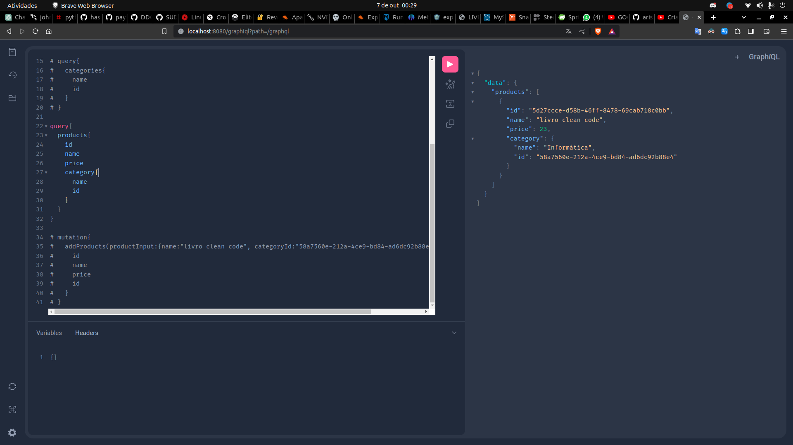
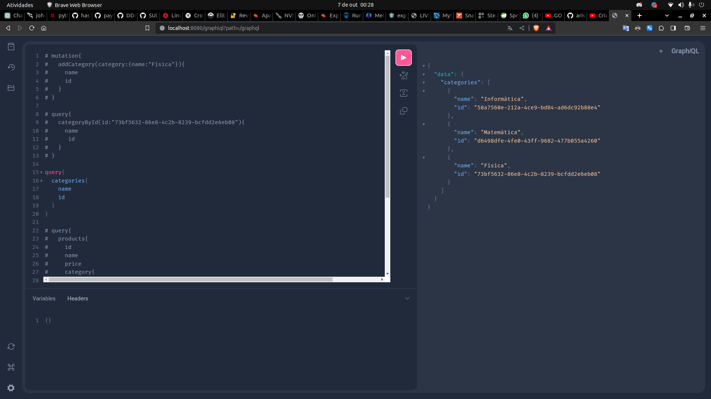

<h1 align="center">
<span>Spring Graphql</span>
</h1>
<br>
<h2 align="start"> About</h2>
 
In this project I learned about how to implement a [graphql](https://graphql.org/) Api in Java Spring.
<br>

## Usage

### mutations
```

addCategory : Insert a new category
addProducts : Insert a new Product

```
### Queries
```

categoryById : Returns a category by id 
products     : Returns all products and their categories
categories   : Returns all categories
```

<br>




